# MeCoGUI

MeCoGUI is a minimalistic Graphic User Interface (GUI) for the modeling and simulation of P-Lingua models using pLinguaCore. MeCoGUI provides controls to parse, simulate and export P system specifications.

To run MeCoGUI, download the file __jar/MeCoGUI.jar__. Then, type in a command prompt console:

> java -jar MeCoGUI.jar

After this, the following interface must appear:

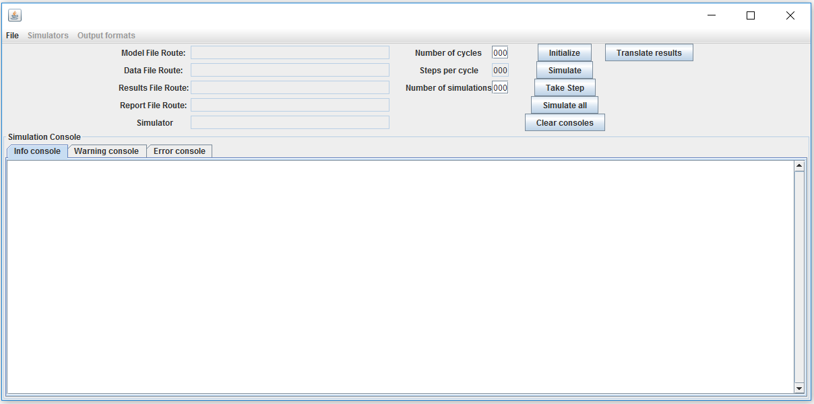

To load a P-Lingua model, click on _File_>_Load Model_ and select the P-Lingua specification to simulate.

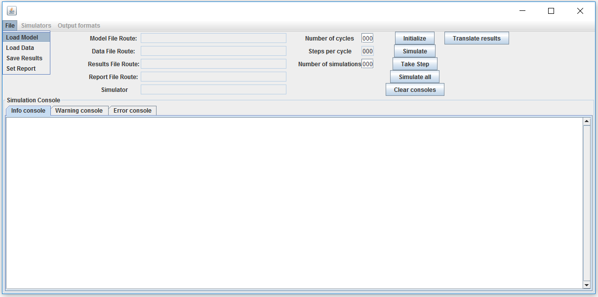

Then, click on _File_>_Load Data_ and select the parameters of the model in _.CSV_ format. 

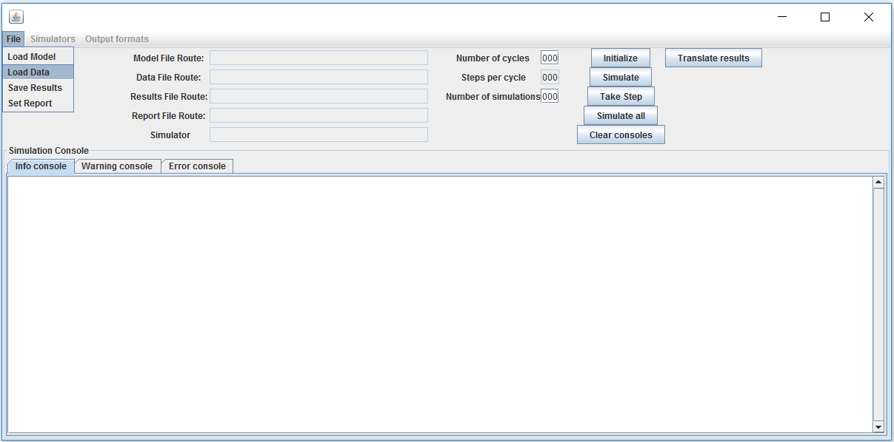

The parameters file must contain a _steps_per_cycle_ parameter indicating how many steps compose a simulation cycle.

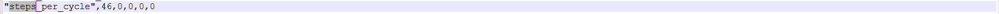

Optionally, a report file with simulation statistics can also be generated clicking on _File_>_Set Report_. Thsi file will be generated during the simulations.

The routes of the selected files will appear in MeCoGUI.

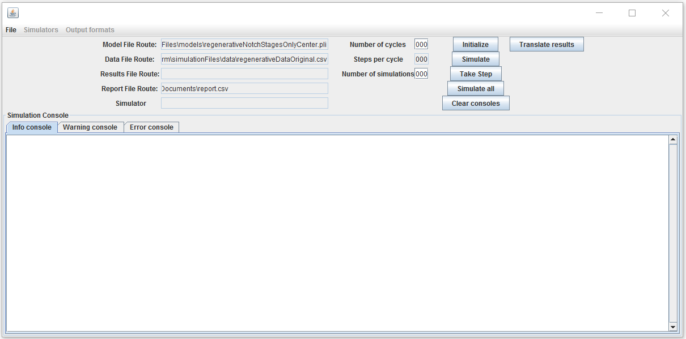

Once the _Model_ and _Data_ file routes have been set, the P system can be parsed clicking on _Initialize_.

If the parsing process produced no errors, the parsed model should appear on the _Info console_ tab. Otherwise, errors will appear on the _Error console_ tab. Likewise, any warnings will appear on the _Warning console_ tab.

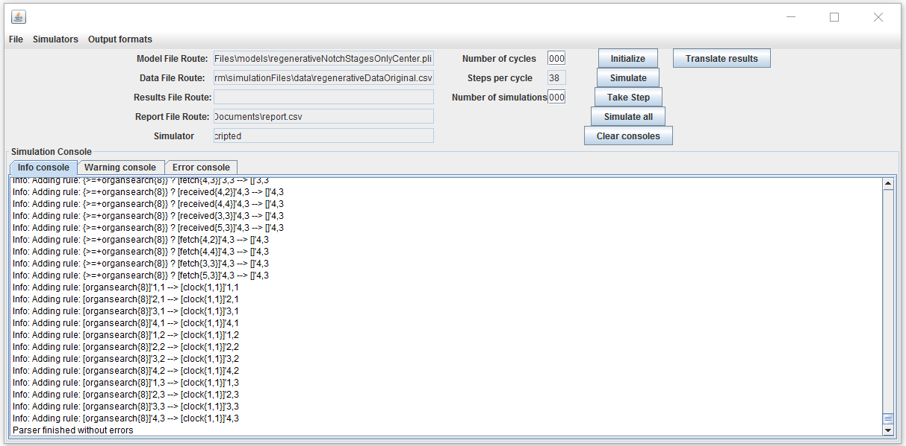

All consoles can be cleared by clicking on the _Clear consoles_ button.

By default, MeCoGUI selects the default simulator for the model indicated by pLinguaCore. A different simulation can be selected by clicking on the _Simulators_ button.

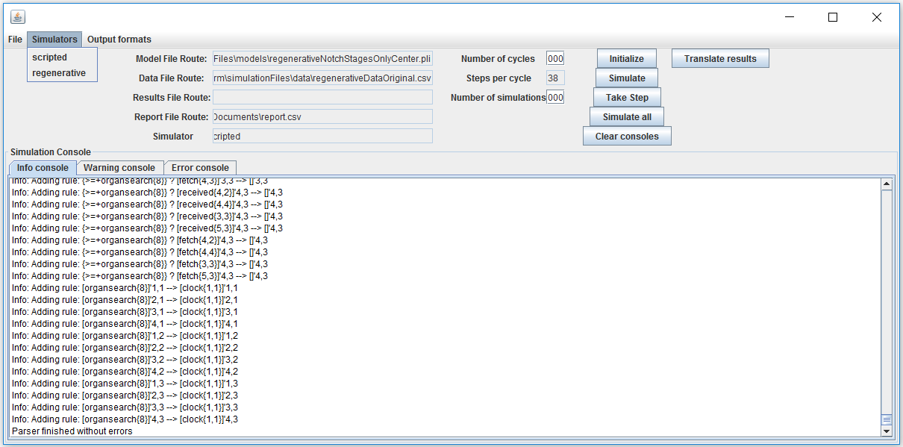

Also, a machine-readable specification of the P system can be generated. This is intended for external simulators not integrated in pLinguaCore. For this, click _Output formats_ and select the desired format for the specification.

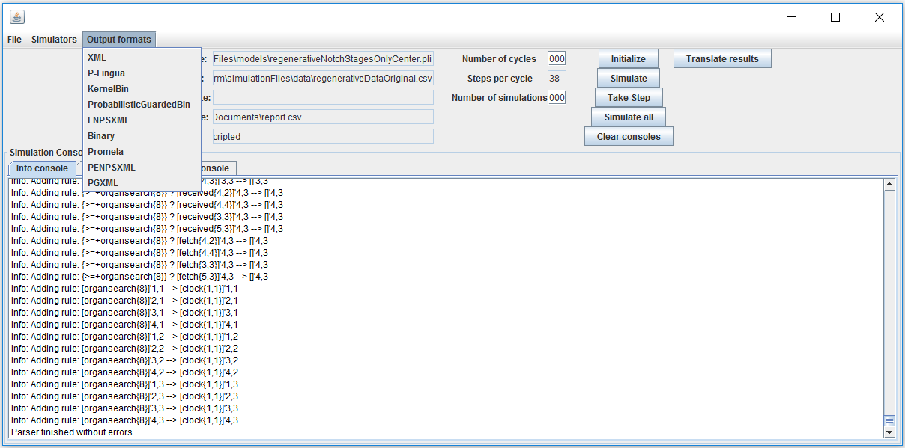

To simulate the system using the selected pLinguaCore simulator, use the following buttons:

* _Take step_ runs a single simulation step.
* _Simulate_ runs as many simulation cycles as indicated in the field _Number of cycles_. Each simulation cycle consists of as many steps as indicated in the field _Steps per cycle_.
* _Simulate all_ runs as many simulations as indicated in the field _Number of simulations_. Each simulation consists of as many simulation cycles as indicated in the field _Number of cycles_.

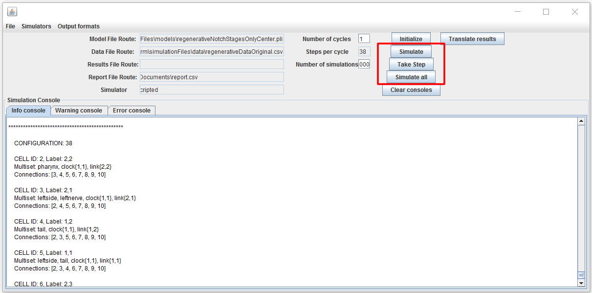

During simulation, the current and previous configurations of the system are displayed in the _Info console_ tab.

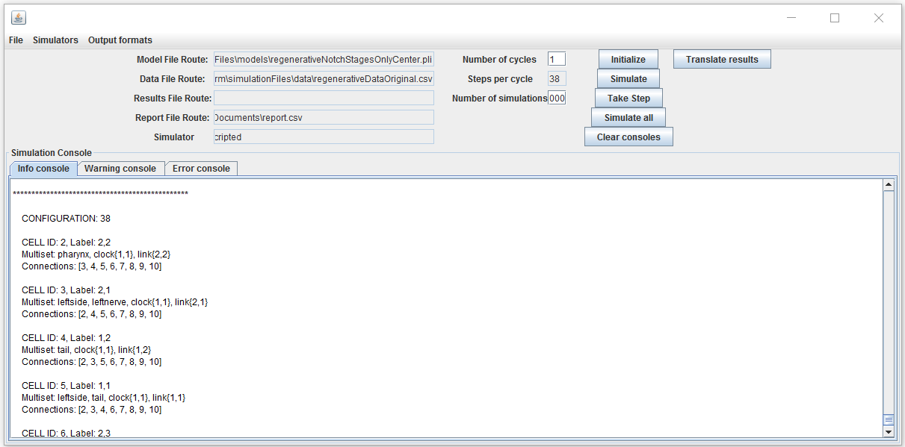

During simulation or when the simulation is finished, the simulation results can be saved in CSV format on the selected file clicking on _File_>_Save Results_.

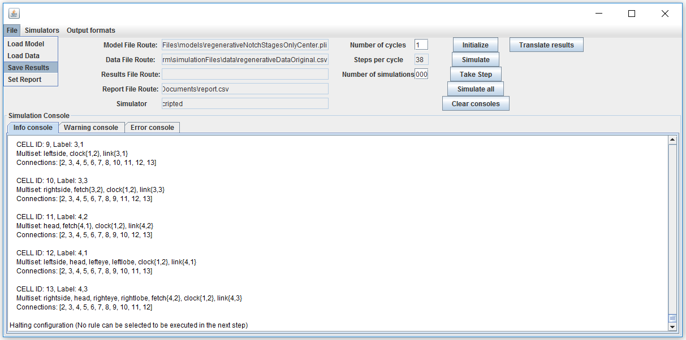

The button _Translate results_ will enable processing of simulation result files in future releases. It is currently in alpha version.

This software is available under the GNU General Public License (GPL) version 3.0.

